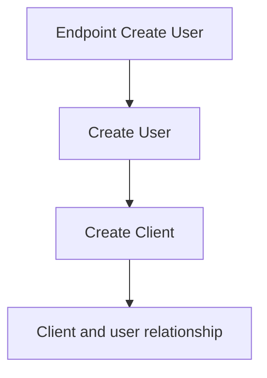
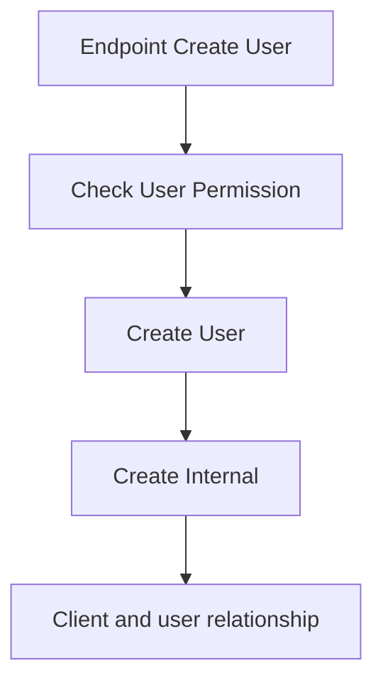

O *User* se trata de uma entidade comum que pode ser relacionado com uma entidade *Client* ou *Internal*. Essas relações definem usuários internos e usuários clientes. Cada um tem regras de negócios diferentes para *CRUD* e operações.

## User Client

O *user client* representa um cliente que utiliza e consome do serviço fornecido pelo sistema. 

Ao criar uma conta o usuário precisa fornecer os seguintes dados:

- Email
- Password
- Name
- Last Name
- CPF (opcional)
- Endereço (opcional)

Fluxo para criar um *user client*:

### User Address

Um usuário opcionalmente pode adicionar um endereço ao criar uma conta. Mas ele se torna obrigatório ao realizar um pedido. As informações necessárias para o *user address* são:

- Street Address
- Number
- CEP
- Complement

---
## User Internal

O *user internal* representa um usuário com permissões especiais para gerenciamento do sistema e procedimentos. Apenas usuários internos com permissão de *user_management* podem criar, editar e desativar usuários. Deletar um *user internal* só pode ser feito pelo super usuário, após o *user internal* ser desativado.

Para criar um *user internal* é necessário os seguintes dados:

- Email
- Password
- Name
- Last name
- CPF
- Role

Fluxo para criar um *user internal*:

### Roles

As *roles* se tratam de um conjunto de permissões que um usuário pode ter. Uma role pode ser criado por um usuário que tenha a permissão *manage_roles*. Para criar uma role é necessário as seguintes informações:

- Name
- Permissions

As *permissions* são pré-definidas no sistema. Uma role só aceita *permissions* válidas.

## Permissions

| Permission   | Description                                                                         |
| ------------ | ----------------------------------------------------------------------------------- |
| manage_users | Permissão para gerenciar usuários. Possibilita criar, editar e desativar um usuário |
| manage_roles | Permissão para gerenciar usuários. Possibilita criar, editar e deletar roles        |
